<div align="center">



<br />

<h3>Your MCP servers are failing. You just don't know it yet.</h3>

<p>
  <a href="https://github.com/decksaga/silentfail/stargazers"></a>
  <a href="https://github.com/decksaga/silentfail/blob/main/LICENSE"></a>
  
  
</p>

</div>

<br />

## The problem

You connect MCP servers to Claude. They break silently — no logs, no errors, no idea which one is slow, dead, or eating your context window.

Every tool you connect costs tokens **before you even type**. A bloated setup with 5 servers can burn **5,000+ tokens** just in schemas. And you'd never know.

**SilentFail finds out.**

<br />

## One command

```bash
silentfail --test
```

```
  🔬 SilentFail — Scan Report
  ──────────────────────────────────────────────────

  OVERVIEW
  ──────────────────────────────────────────────────
  Configs found:    3 (Claude Desktop, Claude Code, Cursor)
  Servers:          4 healthy, 1 failed
  Total tools:      23
  Schema tokens:    ~4,812 (consumed before you type anything)
  Conflicts:        1 ⚠️
  Scan time:        6204ms

  🟢 market-pulse
     Tokens:   ~651 (8 tools, ~81 per tool)
     Tools:
       • get_price (110 tok) ✅
       • get_stock_price (94 tok) ✅
       • get_market_summary (69 tok) ✅

  🔴 broken-server
     Error: Script not found: /old/path/server.js

  📊 TOKEN BUDGET
  ──────────────────────────────────────────────────
  Every connected server costs tokens just by existing.

    browser-tools             ████████████░░░░░░░░  2,340 tok (49%)
    file-system               ██████░░░░░░░░░░░░░░  1,180 tok (25%)
    market-pulse              ███░░░░░░░░░░░░░░░░░    651 tok (14%)
    ...

  ⚠️  CONFLICTS
  ──────────────────────────────────────────────────
    "read_file" → file-system, browser-tools

  💡 RECOMMENDATIONS
  ──────────────────────────────────────────────────
    🔴 [broken-server] Server is broken: Script not found.
       → Fix the configuration or remove this server.
    🟡 [browser-tools] Heavy schema cost: ~2,340 tokens for 12 tools.
       → Consider if you use all 12. Each unused tool wastes context.
    ✅ [market-pulse] Healthy and efficient. 8 tools, ~651 tokens.
```

<br />

## What it finds

| | Feature |
|:--|:--------|
| 🔍 | **Dead servers** — Broken configs, missing scripts, timeouts |
| 🧪 | **Broken tools** — Calls each tool to verify it actually works |
| 📦 | **Token waste** — How many tokens each server burns before you type |
| ⚠️ | **Conflicts** — Tools with the same name across servers |
| 💡 | **Recommendations** — What to fix, remove, or optimize |
| 📂 | **All your configs** — Claude Desktop, Code, Cursor, VS Code, Windsurf |

<br />

## Smart tool testing

SilentFail doesn't just check if servers respond. **It calls each tool.**

It reads the schema and infers valid test inputs — `AAPL` for stocks, `USD`→`EUR` for forex, `bitcoin` for crypto. Then categorizes results:

| Status | Meaning |
|:-------|:--------|
| ✅ Passed | Works, returned data |
| 🔴 Broken | Runtime error, tool is dead |
| 🟡 Input rejected | Tool works, rejected test input (validation is fine) |
| ⏭️ Skipped | Couldn't infer safe params |
| ⏱️ Timeout | Took too long to respond |

**No false positives.** If it says broken, it's broken.

<br />

## Quick start

```bash
git clone https://github.com/decksaga/silentfail.git
cd silentfail
npm install
npm run build
```

Then run it:

```bash
node dist/index.js           # Quick scan
node dist/index.js --test    # Full scan + test tools
```

Or link it globally:

```bash
npm link
silentfail --test
```

<br />

## Usage

```bash
# Quick scan — health + tokens + conflicts
silentfail

# Full scan — tests every tool
silentfail --test

# Web dashboard with visual report
silentfail --dashboard

# JSON output for CI/automation
silentfail --json

# Help
silentfail --help
```

<br />

## Supported clients

| Client | Config path |
|:-------|:-----|
| Claude Desktop | `%APPDATA%/Claude/claude_desktop_config.json` |
| Claude Code | `~/.claude/settings.json` |
| Cursor | `~/.cursor/mcp.json` |
| VS Code | `~/.vscode/mcp.json` |
| Windsurf | `~/.windsurf/mcp.json` |
| Project-level | `./.mcp.json`, `./.claude/settings.json` |

<br />

## How it works

```
┌─────────────┐     ┌──────────────┐     ┌───────────────┐     ┌──────────────┐
│  Discovery   │────▶│   Connect    │────▶│  Test Tools   │────▶│   Report     │
│              │     │              │     │               │     │              │
│ Find configs │     │ Spawn each   │     │ Infer params  │     │ CLI output   │
│ across all   │     │ MCP server   │     │ from schema   │     │ Dashboard    │
│ clients      │     │ via stdio    │     │ Call & verify  │     │ JSON export  │
└─────────────┘     └──────────────┘     └───────────────┘     └──────────────┘
```

<br />

## License

MIT — do whatever you want with it.

<br />

<div align="center">

Built by [@decksaga](https://github.com/decksaga)

<sub>Stop guessing. Start scanning.</sub>

</div>
